# VinJobs — Tài liệu thiết kế hướng đối tượng (OOP)

> **Recruitment & Career Portal** — Phiên bản v1.0

---

## Mục lục

1. [Tổng quan](#1-tổng-quan)
2. [Kiến trúc module](#2-kiến-trúc-module)
3. [Nguyên lý OOP](#3-nguyên-lý-oop)
   - 3.1 Đóng gói (Encapsulation)
   - 3.2 Kế thừa (Inheritance)
   - 3.3 Đa hình (Polymorphism)
   - 3.4 Trừu tượng (Abstraction)
4. [Vai trò người dùng](#4-vai-trò-người-dùng)
   - 4.1 Candidate
   - 4.2 Employer
   - 4.3 Content Manager
   - 4.4 Admin
5. [Use Case Diagrams](#5-use-case-diagrams)
6. [Class Diagrams](#6-class-diagrams)
7. [Phân tích quan hệ OOP](#7-phân-tích-quan-hệ-oop)
8. [Database](#8-database)
   - 8.1 ERD
   - 8.2 Enums
   - 8.3 SQL DDL
9. [Design Patterns](#9-design-patterns)
   - 9.1 Singleton
   - 9.2 Facade
   - 9.3 Bridge
10. [Sequence Diagrams](#10-sequence-diagrams)
11. [State Diagrams](#11-state-diagrams)
12. [Activity Diagrams](#12-activity-diagrams)
13. [Tổng kết](#13-tổng-kết)

---

## 1. Tổng quan

VinJobs là hệ thống tuyển dụng trực tuyến kết nối nhà tuyển dụng với ứng viên. Hệ thống cho phép đăng tin tuyển dụng, ứng tuyển việc làm, quản lý gói dịch vụ thanh toán, và cung cấp nội dung hướng nghiệp qua module blog.

### Thông tin dự án

| Hạng mục | Chi tiết |
|----------|---------|
| **Tên dự án** | VinJobs — Recruitment & Career Portal |
| **Môn học** | Lập trình hướng đối tượng (OOP) |
| **Ngôn ngữ minh họa** | Java |
| **Database** | MySQL |
| **Số module** | 3 (Recruitment, Payment, Blog) |
| **Số vai trò** | 4 (Admin, Employer, Candidate, ContentManager) |
| **Design Patterns** | Singleton, Facade, Bridge |
| **Tổng class** | 25+ |
| **Tổng bảng DB** | 13 |

---

## 2. Kiến trúc module

Hệ thống chia thành **3 module nghiệp vụ** và các **core service** dùng chung:

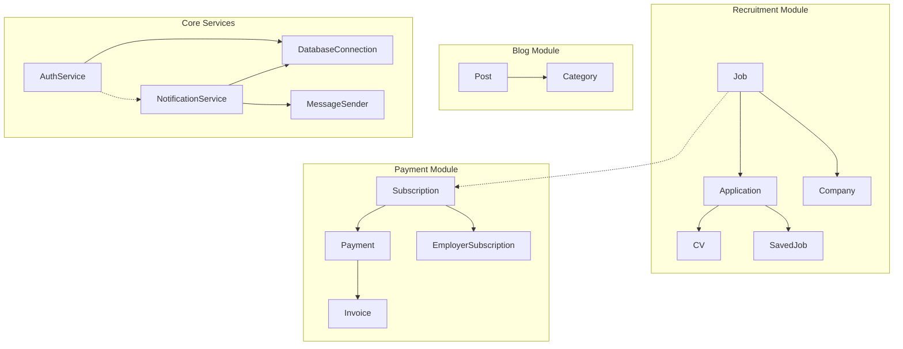
```mermaid
graph TB
subgraph "Recruitment Module"
J[Job] --> A[Application]
J --> C[Company]
A --> CV[CV]
A --> SJ[SavedJob]
end
subgraph "Payment Module"
SUB[Subscription] --> PAY[Payment]
PAY --> INV[Invoice]
SUB --> ES[EmployerSubscription]
end
subgraph "Blog Module"
PO[Post] --> CA[Category]
end
subgraph "Core Services"
AU[AuthService] --> DB[DatabaseConnection]
NF[NotificationService] --> DB
NF --> MS[MessageSender]
end
J -.-> SUB
AU -.-> NF
```

### Chi tiết các module

| Module | Chức năng | Class chính |
|--------|-----------|-------------|
| **Recruitment** | Quản lý tuyển dụng, ứng tuyển, công ty, CV | Job, Application, Company, CV, SavedJob |
| **Payment** | Gói dịch vụ, thanh toán, hóa đơn | Subscription, Payment, Invoice, EmployerSubscription |
| **Blog** | Bài viết hướng nghiệp, danh mục | Post, Category |
| **Core** | Xác thực, thông báo, kết nối DB | AuthService, NotificationService, DatabaseConnection |

---

## 3. Nguyên lý OOP

### 3.1 Đóng gói (Encapsulation)

Đóng gói là nguyên lý **ẩn dữ liệu bên trong class**, chỉ cho phép truy cập thông qua các phương thức public (getter/setter). Trong VinJobs, tất cả thuộc tính đều khai báo `private` hoặc `protected`.

#### Ví dụ: Class User

```java
public abstract class User {
    // Thuộc tính protected — chỉ class con truy cập được
    protected int id;
    protected String name;
    protected String email;
    private String password;    // private — ẩn hoàn toàn
    protected Role role;
    protected UserStatus status;

    // Getter public — cho phép đọc từ bên ngoài
    public String getName() { return this.name; }
    public String getEmail() { return this.email; }
    public Role getRole() { return this.role; }

    // Setter có validation — kiểm soát dữ liệu đầu vào
    public void setEmail(String email) {
        if (email == null || !email.contains("@"))
            throw new IllegalArgumentException("Email không hợp lệ");
        this.email = email;
    }

    // password không có getter public → bảo mật
    public boolean verifyPassword(String input) {
        return BCrypt.checkpw(input, this.password);
    }
}
```

#### Bảng Access Modifier

| Access Modifier | Class | Package | Subclass | Bên ngoài | Dùng trong VinJobs |
|----------------|-------|---------|----------|-----------|---------------------|
| `private` | Có | Không | Không | Không | password, connection (Singleton) |
| `protected` | Có | Có | Có | Không | id, name, email, role trong User |
| `public` | Có | Có | Có | Có | getter, setter, login(), postJob() |
| `default` | Có | Có | Không | Không | Helper methods nội bộ |

---

### 3.2 Kế thừa (Inheritance)

Kế thừa cho phép class con thừa hưởng thuộc tính và phương thức từ class cha. VinJobs sử dụng kế thừa ở **2 chỗ chính**: phân cấp `User` và phân cấp `Notification`.

#### Sơ đồ kế thừa User

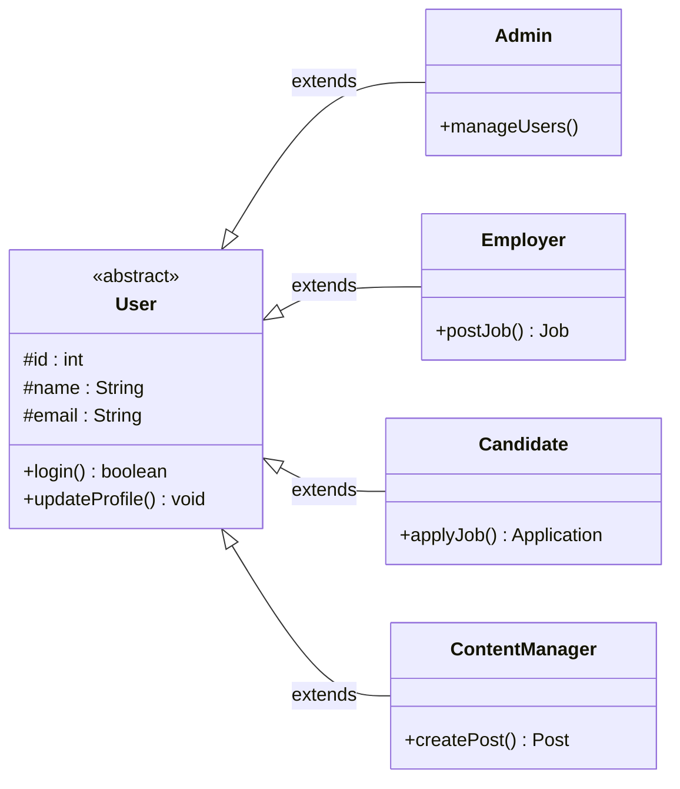
```mermaid
classDiagram
direction LR
class User {
<<abstract>>
#id : int
#name : String
#email : String
+login() boolean
+updateProfile() void
}
class Admin {
+manageUsers()
}
class Employer {
+postJob() Job
}
class Candidate {
+applyJob() Application
}
class ContentManager {
+createPost() Post
}
User <|-- Admin : extends
User <|-- Employer : extends
User <|-- Candidate : extends
User <|-- ContentManager : extends
```

#### Code minh họa

```java
// Class cha — abstract, không thể tạo instance trực tiếp
public abstract class User {
    protected int id;
    protected String name;
    protected String email;

    public boolean login() { /* logic chung */ }
    public void updateProfile() { /* logic chung */ }
}

// Class con — kế thừa User, thêm thuộc tính/phương thức riêng
public class Employer extends User {
    private Company company;           // thuộc tính riêng
    private Subscription activeSub;

    public Job postJob(Job job) { ... }  // phương thức riêng
    public int getRemainingJobSlots() { ... }

    // Employer vẫn dùng được login(), updateProfile() từ User
}

public class Candidate extends User {
    private int experienceYears;
    private List<CV> cvList;

    public Application applyJob(int jobId, int cvId) { ... }
    public List<Job> searchJobs(SearchCriteria criteria) { ... }
}
```

#### Bảng kế thừa trong VinJobs

| Class cha | Class con | Thuộc tính kế thừa | Phương thức riêng |
|-----------|-----------|---------------------|-------------------|
| **User** (abstract) | Admin | id, name, email, role, status | manageUsers(), blockUser(), getRevenueStats() |
| | Employer | id, name, email, role, status | postJob(), purchaseSubscription(), getRemainingJobSlots() |
| | Candidate | id, name, email, role, status | uploadCV(), applyJob(), searchJobs(), saveJob() |
| | ContentManager | id, name, email, role, status | createPost(), editPost(), managePosts() |
| **Notification** (abstract) | JobApprovedNotification | id, title, message, sender | send() — nội dung job approved |
| | PaymentSuccessNotification | id, title, message, sender | send() — nội dung thanh toán |
| | ApplicationNotification | id, title, message, sender | send() — nội dung ứng tuyển |
| | ApplicationStatusNotification | id, title, message, sender | send() — nội dung đổi trạng thái |
| | PostApprovedNotification | id, title, message, sender | send() — nội dung bài viết |

---

### 3.3 Đa hình (Polymorphism)

Đa hình cho phép cùng một phương thức có hành vi khác nhau tùy theo class con. VinJobs thể hiện đa hình ở **2 dạng**:

#### a) Override — Ghi đè phương thức

Mỗi loại `Notification` ghi đè phương thức `send()` với nội dung khác nhau:

```java
public abstract class Notification {
    protected MessageSender sender;
    public abstract void send();  // abstract — bắt buộc class con phải override
}

public class JobApprovedNotification extends Notification {
    private Job job;
    @Override
    public void send() {
        sender.sendMessage(employer.getEmail(),
            "Tin tuyển dụng đã được duyệt",
            "Tin '" + job.getTitle() + "' đã active");
    }
}

public class PaymentSuccessNotification extends Notification {
    private Payment payment;
    @Override
    public void send() {
        sender.sendMessage(employer.getEmail(),
            "Thanh toán thành công",
            "Số tiền: " + payment.getAmount() + " VNĐ");
    }
}

// Polymorphism — biến kiểu cha, object kiểu con
Notification n1 = new JobApprovedNotification(sender, job);
Notification n2 = new PaymentSuccessNotification(sender, payment);
n1.send();  // gọi JobApprovedNotification.send()
n2.send();  // gọi PaymentSuccessNotification.send()
```

#### b) Interface — Đa hình qua interface

Interface `MessageSender` có nhiều implementation với hành vi khác nhau:

```java
public interface MessageSender {
    boolean sendMessage(String to, String title, String body);
}

public class EmailSender implements MessageSender {
    @Override
    public boolean sendMessage(String to, String title, String body) {
        // Gửi qua SMTP server
        return true;
    }
}

public class SmsSender implements MessageSender {
    @Override
    public boolean sendMessage(String to, String title, String body) {
        // Gửi qua SMS API (Twilio, ...)
        return true;
    }
}

// Cùng kiểu MessageSender, hành vi khác nhau
MessageSender s1 = new EmailSender();
MessageSender s2 = new SmsSender();
s1.sendMessage("a@b.com", "Hi", "...");  // gửi email
s2.sendMessage("0901...", "Hi", "...");   // gửi SMS
```

---

### 3.4 Trừu tượng (Abstraction)

Trừu tượng là **ẩn đi chi tiết thực thi**, chỉ cung cấp giao diện sử dụng. VinJobs thể hiện qua abstract class và interface:

| Loại | Class/Interface | Phần trừu tượng | Phần cụ thể (class con) |
|------|----------------|-----------------|------------------------|
| Abstract Class | `User` | Định nghĩa login(), updateProfile() | Admin, Employer, Candidate, ContentManager |
| Abstract Class | `Notification` | Định nghĩa send() — abstract | JobApproved.., PaymentSuccess.., Application.. |
| Interface | `MessageSender` | Định nghĩa sendMessage() | EmailSender, SmsSender, PushSender |

```java
// Abstract class — không thể new User() trực tiếp
User u1 = new User();       // LỖI COMPILE
User u2 = new Employer();   // OK — tạo qua class con
User u3 = new Candidate();  // OK

// Interface — không thể new MessageSender() trực tiếp
MessageSender s = new EmailSender();  // OK — tạo qua implementation
```

---

## 4. Vai trò người dùng

### 4.1 Candidate

Người tìm việc — đăng ký, tạo hồ sơ, ứng tuyển.

| STT | Chức năng | Mô tả | Phương thức |
|-----|-----------|-------|-------------|
| 1 | Đăng ký, đăng nhập | Tạo tài khoản, xác thực | login(), register() |
| 2 | Tạo hồ sơ | Thông tin cá nhân, kinh nghiệm | createProfile() |
| 3 | Upload CV | Tải lên file PDF/DOCX | uploadCV(file) |
| 4 | Tìm kiếm việc làm | Theo từ khóa, vị trí, lương | searchJobs(criteria) |
| 5 | Ứng tuyển | Gửi hồ sơ ứng tuyển | applyJob(jobId, cvId) |
| 6 | Theo dõi trạng thái | Xem trạng thái đơn | trackApplications() |
| 7 | Lưu việc làm | Bookmark job yêu thích | saveJob(jobId) |

---

### 4.2 Employer

Nhà tuyển dụng — tạo công ty, mua gói, đăng tin, quản lý ứng viên.

| STT | Chức năng | Mô tả | Phương thức |
|-----|-----------|-------|-------------|
| 1 | Tạo công ty | Đăng ký thông tin công ty | createCompany(data) |
| 2 | Mua gói đăng tuyển | Chọn và thanh toán gói | purchaseSubscription(id) |
| 3 | Đăng tin tuyển dụng | Tạo bài đăng (yêu cầu gói) | postJob(job) |
| 4 | Quản lý tin | Sửa, ẩn, xóa tin | manageJobs() |
| 5 | Xem ứng viên | Danh sách ứng viên theo job | viewApplicants(jobId) |
| 6 | Duyệt / Từ chối | Đổi trạng thái ứng viên | approveApplication(id) |

> [!WARNING]
> **Lưu ý:** Employer bắt buộc mua gói trước khi đăng bài. Không có chế độ miễn phí.

#### Gói dịch vụ

| Gói | Giá | Số bài | Thời hạn |
|-----|-----|--------|----------|
| **Basic** | 200.000 đ | 5 | 30 ngày |
| **Premium** | 500.000 đ | 20 | 60 ngày |
| **Enterprise** | 2.000.000 đ | Unlimited | 365 ngày |

---

### 4.3 Content Manager

Quản lý nội dung blog — viết bài hướng nghiệp, tin tức ngành.

| STT | Chức năng | Mô tả | Phương thức |
|-----|-----------|-------|-------------|
| 1 | Viết bài blog | Soạn bài hướng nghiệp | createPost(post) |
| 2 | Đăng tin tức | Xu hướng ngành, tips | createPost(post) |
| 3 | Quản lý bài viết | Sửa, xóa, ẩn bài | editPost(), deletePost() |
| 4 | Quản lý danh mục | Tạo và sửa category | manageCategories() |

> [!CAUTION]
> **Lưu ý:** Content Manager không có quyền quản lý tuyển dụng.

---

### 4.4 Admin

Quản trị toàn bộ hệ thống.

| STT | Chức năng | Mô tả | Phương thức |
|-----|-----------|-------|-------------|
| 1 | Quản lý user | CRUD tất cả người dùng | manageUsers() |
| 2 | Quản lý công ty | Duyệt, khóa công ty | manageCompanies() |
| 3 | Quản lý gói | Tạo/sửa subscription | manageSubscriptions() |
| 4 | Quản lý thanh toán | Lịch sử, hoàn tiền | managePayments() |
| 5 | Duyệt bài viết | Approve/reject blog | approvePost(id) |
| 6 | Thống kê | Dashboard doanh thu | getRevenueStats() |
| 7 | Khóa tài khoản | Ban user vi phạm | blockUser(id) |

---

## 5. Use Case Diagrams

### 5.1 Use Case — Candidate

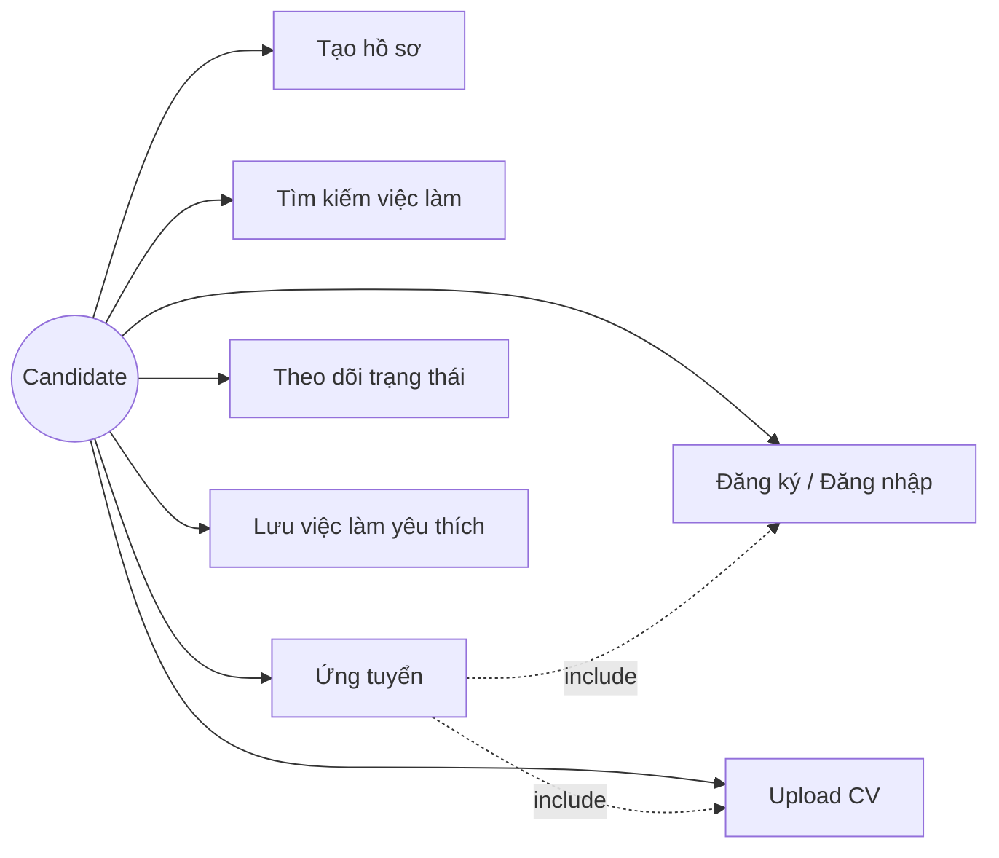
```mermaid
graph LR
C((Candidate))
C --> UC1[Đăng ký / Đăng nhập]
C --> UC2[Tạo hồ sơ]
C --> UC3[Upload CV]
C --> UC4[Tìm kiếm việc làm]
C --> UC5[Ứng tuyển]
C --> UC6[Theo dõi trạng thái]
C --> UC7[Lưu việc làm yêu thích]
UC5 -.->|include| UC3
UC5 -.->|include| UC1
```

### 5.2 Use Case — Employer

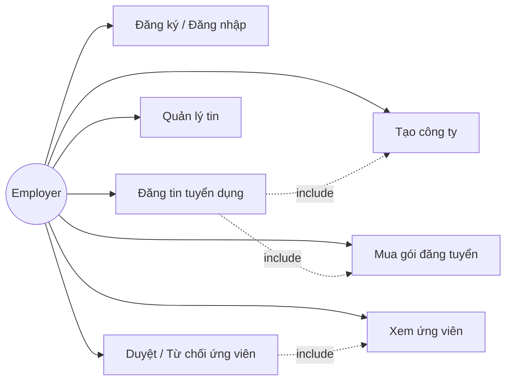
```mermaid
graph LR
E((Employer))
E --> UC1[Đăng ký / Đăng nhập]
E --> UC2[Tạo công ty]
E --> UC3[Mua gói đăng tuyển]
E --> UC4[Đăng tin tuyển dụng]
E --> UC5[Quản lý tin]
E --> UC6[Xem ứng viên]
E --> UC7[Duyệt / Từ chối ứng viên]
UC4 -.->|include| UC3
UC4 -.->|include| UC2
UC7 -.->|include| UC6
```

### 5.3 Use Case — Admin & Content Manager

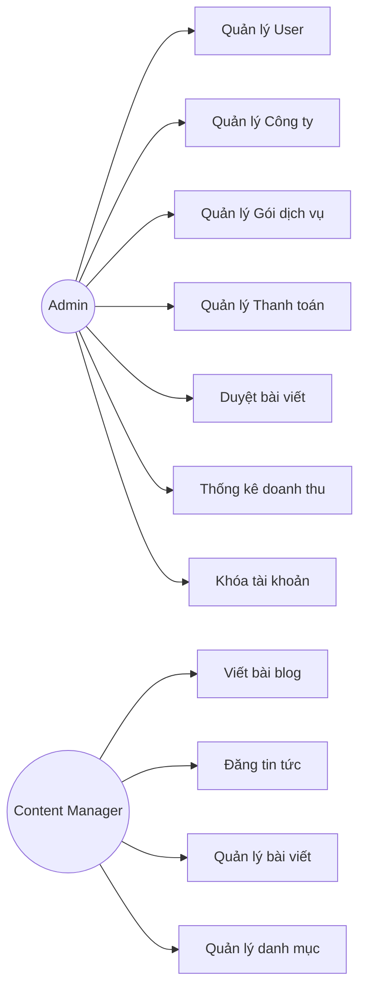
```mermaid
graph LR
A((Admin))
CM((Content Manager))
A --> AU1[Quản lý User]
A --> AU2[Quản lý Công ty]
A --> AU3[Quản lý Gói dịch vụ]
A --> AU4[Quản lý Thanh toán]
A --> AU5[Duyệt bài viết]
A --> AU6[Thống kê doanh thu]
A --> AU7[Khóa tài khoản]
CM --> CM1[Viết bài blog]
CM --> CM2[Đăng tin tức]
CM --> CM3[Quản lý bài viết]
CM --> CM4[Quản lý danh mục]
```

---

## 6. Class Diagrams

### 6.1 Phân cấp User

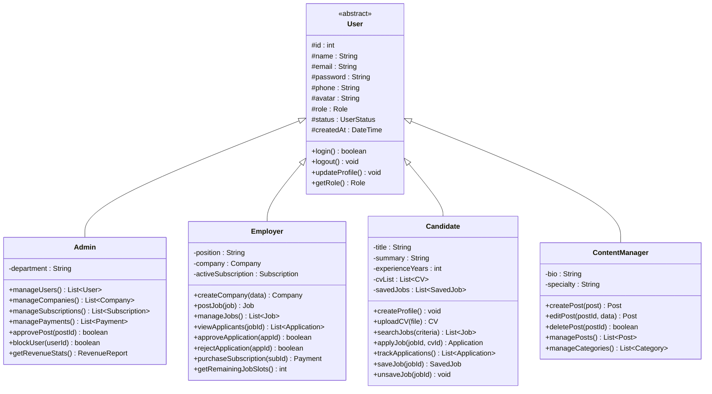
```mermaid
classDiagram
direction TB
class User {
<<abstract>>
#id : int
#name : String
#email : String
#password : String
#phone : String
#avatar : String
#role : Role
#status : UserStatus
#createdAt : DateTime
+login() boolean
+logout() void
+updateProfile() void
+getRole() Role
}
class Admin {
-department : String
+manageUsers() List~User~
+manageCompanies() List~Company~
+manageSubscriptions() List~Subscription~
+managePayments() List~Payment~
+approvePost(postId) boolean
+blockUser(userId) boolean
+getRevenueStats() RevenueReport
}
class Employer {
-position : String
-company : Company
-activeSubscription : Subscription
+createCompany(data) Company
+postJob(job) Job
+manageJobs() List~Job~
+viewApplicants(jobId) List~Application~
+approveApplication(appId) boolean
+rejectApplication(appId) boolean
+purchaseSubscription(subId) Payment
+getRemainingJobSlots() int
}
class Candidate {
-title : String
-summary : String
-experienceYears : int
-cvList : List~CV~
-savedJobs : List~SavedJob~
+createProfile() void
+uploadCV(file) CV
+searchJobs(criteria) List~Job~
+applyJob(jobId, cvId) Application
+trackApplications() List~Application~
+saveJob(jobId) SavedJob
+unsaveJob(jobId) void
}
class ContentManager {
-bio : String
-specialty : String
+createPost(post) Post
+editPost(postId, data) Post
+deletePost(postId) boolean
+managePosts() List~Post~
+manageCategories() List~Category~
}
User <|-- Admin
User <|-- Employer
User <|-- Candidate
User <|-- ContentManager
```

#### Chi tiết thuộc tính — User (Abstract)

| Modifier | Thuộc tính | Kiểu | Mô tả | Ràng buộc |
|----------|-----------|------|-------|-----------|
| # | id | int | Khóa chính | Auto increment |
| # | name | String | Họ tên | NOT NULL, max 100 |
| # | email | String | Email đăng nhập | UNIQUE, NOT NULL |
| - | password | String | Mật khẩu (hashed) | NOT NULL, min 6 ký tự |
| # | phone | String | Số điện thoại | Optional |
| # | avatar | String | URL ảnh đại diện | Optional |
| # | role | Role | Vai trò | Enum, NOT NULL |
| # | status | UserStatus | Trạng thái tài khoản | Default: PENDING |
| # | createdAt | DateTime | Ngày tạo | Auto |

#### Chi tiết thuộc tính riêng — Employer

| Modifier | Thuộc tính | Kiểu | Mô tả |
|----------|-----------|------|-------|
| - | position | String | Chức vụ tại công ty |
| - | company | Company | Công ty đã tạo (0..1) |
| - | activeSubscription | Subscription | Gói đang sử dụng |

#### Chi tiết thuộc tính riêng — Candidate

| Modifier | Thuộc tính | Kiểu | Mô tả |
|----------|-----------|------|-------|
| - | title | String | Chức danh mong muốn |
| - | summary | String | Tóm tắt bản thân |
| - | experienceYears | int | Số năm kinh nghiệm |
| - | cvList | List\<CV\> | Danh sách CV đã upload |
| - | savedJobs | List\<SavedJob\> | Việc làm đã lưu |

---

### 6.2 Recruitment Module

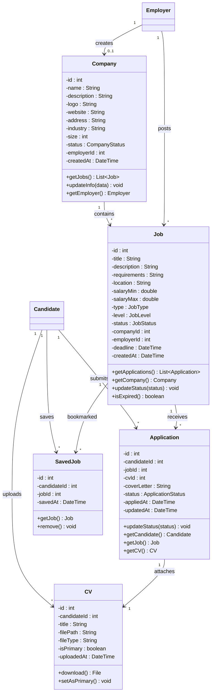
```mermaid
classDiagram
direction TB
class Company {
-id : int
-name : String
-description : String
-logo : String
-website : String
-address : String
-industry : String
-size : int
-status : CompanyStatus
-employerId : int
-createdAt : DateTime
+getJobs() List~Job~
+updateInfo(data) void
+getEmployer() Employer
}
class Job {
-id : int
-title : String
-description : String
-requirements : String
-location : String
-salaryMin : double
-salaryMax : double
-type : JobType
-level : JobLevel
-status : JobStatus
-companyId : int
-employerId : int
-deadline : DateTime
-createdAt : DateTime
+getApplications() List~Application~
+getCompany() Company
+updateStatus(status) void
+isExpired() boolean
}
class Application {
-id : int
-candidateId : int
-jobId : int
-cvId : int
-coverLetter : String
-status : ApplicationStatus
-appliedAt : DateTime
-updatedAt : DateTime
+updateStatus(status) void
+getCandidate() Candidate
+getJob() Job
+getCV() CV
}
class CV {
-id : int
-candidateId : int
-title : String
-filePath : String
-fileType : String
-isPrimary : boolean
-uploadedAt : DateTime
+download() File
+setAsPrimary() void
}
class SavedJob {
-id : int
-candidateId : int
-jobId : int
-savedAt : DateTime
+getJob() Job
+remove() void
}
Employer "1" --> "0..1" Company : creates
Company "1" --> "*" Job : contains
Employer "1" --> "*" Job : posts
Candidate "1" --> "*" Application : submits
Job "1" --> "*" Application : receives
Candidate "1" --> "*" CV : uploads
Application "1" --> "1" CV : attaches
Candidate "1" --> "*" SavedJob : saves
Job "1" --> "*" SavedJob : bookmarked
```

---

### 6.3 Payment Module

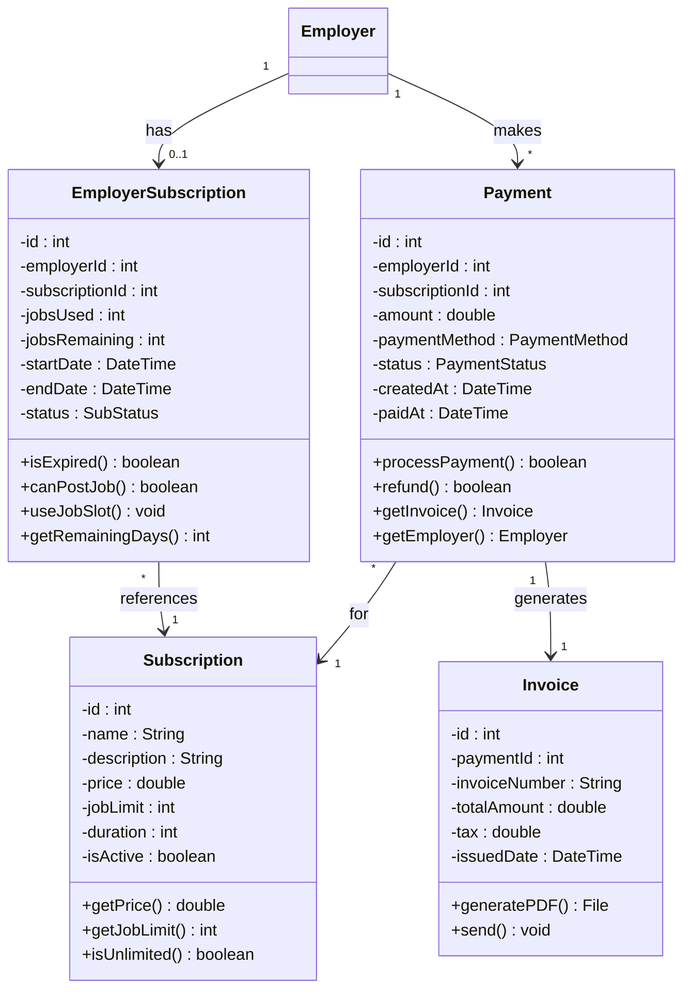
```mermaid
classDiagram
direction TB
class Subscription {
-id : int
-name : String
-description : String
-price : double
-jobLimit : int
-duration : int
-isActive : boolean
+getPrice() double
+getJobLimit() int
+isUnlimited() boolean
}
class Payment {
-id : int
-employerId : int
-subscriptionId : int
-amount : double
-paymentMethod : PaymentMethod
-status : PaymentStatus
-createdAt : DateTime
-paidAt : DateTime
+processPayment() boolean
+refund() boolean
+getInvoice() Invoice
+getEmployer() Employer
}
class Invoice {
-id : int
-paymentId : int
-invoiceNumber : String
-totalAmount : double
-tax : double
-issuedDate : DateTime
+generatePDF() File
+send() void
}
class EmployerSubscription {
-id : int
-employerId : int
-subscriptionId : int
-jobsUsed : int
-jobsRemaining : int
-startDate : DateTime
-endDate : DateTime
-status : SubStatus
+isExpired() boolean
+canPostJob() boolean
+useJobSlot() void
+getRemainingDays() int
}
Employer "1" --> "*" Payment : makes
Payment "*" --> "1" Subscription : for
Payment "1" --> "1" Invoice : generates
Employer "1" --> "0..1" EmployerSubscription : has
EmployerSubscription "*" --> "1" Subscription : references
```

---

### 6.4 Blog Module

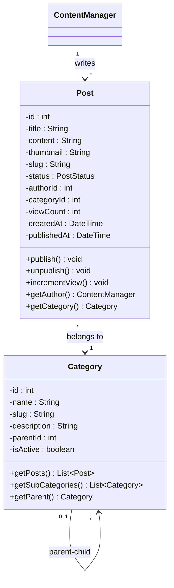
```mermaid
classDiagram
direction TB
class Post {
-id : int
-title : String
-content : String
-thumbnail : String
-slug : String
-status : PostStatus
-authorId : int
-categoryId : int
-viewCount : int
-createdAt : DateTime
-publishedAt : DateTime
+publish() void
+unpublish() void
+incrementView() void
+getAuthor() ContentManager
+getCategory() Category
}
class Category {
-id : int
-name : String
-slug : String
-description : String
-parentId : int
-isActive : boolean
+getPosts() List~Post~
+getSubCategories() List~Category~
+getParent() Category
}
ContentManager "1" --> "*" Post : writes
Post "*" --> "1" Category : belongs to
Category "0..1" --> "*" Category : parent-child
```

---

### 6.5 Notification (Bridge Pattern)

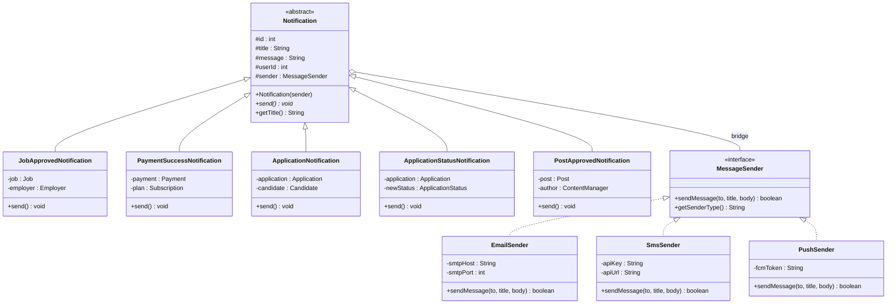
```mermaid
classDiagram
class Notification {
<<abstract>>
#id : int
#title : String
#message : String
#userId : int
#sender : MessageSender
+Notification(sender)
+send()* void
+getTitle() String
}
class JobApprovedNotification {
-job : Job
-employer : Employer
+send() void
}
class PaymentSuccessNotification {
-payment : Payment
-plan : Subscription
+send() void
}
class ApplicationNotification {
-application : Application
-candidate : Candidate
+send() void
}
class ApplicationStatusNotification {
-application : Application
-newStatus : ApplicationStatus
+send() void
}
class PostApprovedNotification {
-post : Post
-author : ContentManager
+send() void
}
class MessageSender {
<<interface>>
+sendMessage(to, title, body) boolean
+getSenderType() String
}
class EmailSender {
-smtpHost : String
-smtpPort : int
+sendMessage(to, title, body) boolean
}
class SmsSender {
-apiKey : String
-apiUrl : String
+sendMessage(to, title, body) boolean
}
class PushSender {
-fcmToken : String
+sendMessage(to, title, body) boolean
}
Notification <|-- JobApprovedNotification
Notification <|-- PaymentSuccessNotification
Notification <|-- ApplicationNotification
Notification <|-- ApplicationStatusNotification
Notification <|-- PostApprovedNotification
Notification o-- MessageSender : bridge
MessageSender <|.. EmailSender
MessageSender <|.. SmsSender
MessageSender <|.. PushSender
```

---

### 6.6 Class Diagram — Tổng thể hệ thống

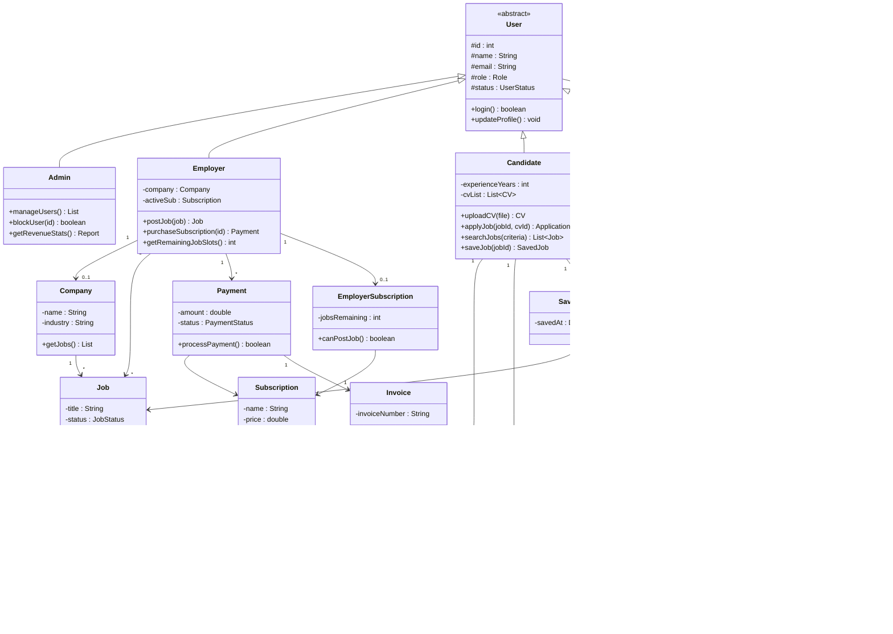
```mermaid
classDiagram
direction TB
class User {
<<abstract>>
#id : int
#name : String
#email : String
#role : Role
#status : UserStatus
+login() boolean
+updateProfile() void
}
class Admin {
+manageUsers() List
+blockUser(id) boolean
+getRevenueStats() Report
}
class Employer {
-company : Company
-activeSub : Subscription
+postJob(job) Job
+purchaseSubscription(id) Payment
+getRemainingJobSlots() int
}
class Candidate {
-experienceYears : int
-cvList : List~CV~
+uploadCV(file) CV
+applyJob(jobId, cvId) Application
+searchJobs(criteria) List~Job~
+saveJob(jobId) SavedJob
}
class ContentManager {
-specialty : String
+createPost(post) Post
+editPost(id, data) Post
}
class Company {
-name : String
-industry : String
+getJobs() List
}
class Job {
-title : String
-status : JobStatus
+isExpired() boolean
}
class Application {
-status : ApplicationStatus
+updateStatus(s) void
}
class CV {
-filePath : String
-isPrimary : boolean
}
class SavedJob {
-savedAt : DateTime
}
class Subscription {
-name : String
-price : double
-jobLimit : int
}
class Payment {
-amount : double
-status : PaymentStatus
+processPayment() boolean
}
class Invoice {
-invoiceNumber : String
+generatePDF() File
}
class EmployerSubscription {
-jobsRemaining : int
+canPostJob() boolean
}
class Post {
-title : String
-status : PostStatus
+publish() void
}
class Category {
-name : String
-slug : String
}
class Notification {
<<abstract>>
#sender : MessageSender
+send() void
}
class MessageSender {
<<interface>>
+sendMessage() boolean
}
User <|-- Admin
User <|-- Employer
User <|-- Candidate
User <|-- ContentManager
Employer "1" --> "0..1" Company
Company "1" --> "*" Job
Employer "1" --> "*" Job
Candidate "1" --> "*" Application
Job "1" --> "*" Application
Candidate "1" --> "*" CV
Application --> CV
Candidate "1" --> "*" SavedJob
SavedJob --> Job
Employer "1" --> "*" Payment
Payment --> Subscription
Payment "1" --> "1" Invoice
Employer "1" --> "0..1" EmployerSubscription
EmployerSubscription --> Subscription
ContentManager "1" --> "*" Post
Post --> Category
User --> Notification
Notification o-- MessageSender
```

---

## 7. Phân tích quan hệ OOP

Hệ thống sử dụng các loại quan hệ sau:

### 7.1 Tổng quan các loại quan hệ

| Loại quan hệ | Ký hiệu UML | Ý nghĩa | Ví dụ trong VinJobs |
|-------------|-------------|---------|---------------------|
| **Inheritance** (Kế thừa) | ——▷ | Class con IS-A class cha | Employer IS-A User |
| **Realization** (Hiện thực) | - - ▷ | Class implement interface | EmailSender implements MessageSender |
| **Association** (Liên kết) | ——> | Class A biết đến Class B | Job --> Company |
| **Aggregation** (Gom nhóm) | ◇——> | Whole-Part, part tồn tại độc lập | Notification ◇--> MessageSender |
| **Composition** (Hợp thành) | ◆——> | Whole-Part, part phụ thuộc whole | Payment ◆--> Invoice |
| **Dependency** (Phụ thuộc) | - - -> | Class A dùng Class B tạm thời | Repository ..> DatabaseConnection |

### 7.2 Bảng quan hệ chi tiết

| Class A | Quan hệ | Bội số | Class B | Loại | Giải thích |
|---------|---------|--------|---------|------|-----------|
| User | Inheritance | — | Admin, Employer, Candidate, CM | IS-A | Class con kế thừa User |
| Notification | Inheritance | — | 5 loại Notification con | IS-A | Override phương thức send() |
| MessageSender | Realization | — | Email, Sms, Push Sender | Implements | Implement interface |
| Employer | Association | 1 — 0..1 | Company | HAS-A | Mỗi employer tạo tối đa 1 công ty |
| Company | Association | 1 — * | Job | HAS-MANY | Mỗi công ty có nhiều tin |
| Candidate | Association | 1 — * | Application | HAS-MANY | Mỗi ứng viên gửi nhiều đơn |
| Job | Association | 1 — * | Application | HAS-MANY | Mỗi job nhận nhiều đơn |
| Candidate | Association | 1 — * | CV | HAS-MANY | Upload nhiều CV |
| Application | Association | * — 1 | CV | USES | Mỗi đơn đính kèm 1 CV |
| Employer | Association | 1 — * | Payment | HAS-MANY | Nhiều giao dịch |
| Payment | Composition | 1 — 1 | Invoice | OWNS | Invoice phụ thuộc Payment |
| Payment | Association | * — 1 | Subscription | FOR | Mua 1 gói |
| Employer | Association | 1 — 0..1 | EmployerSubscription | HAS | Gói active hiện tại |
| ContentManager | Association | 1 — * | Post | HAS-MANY | Viết nhiều bài |
| Post | Association | * — 1 | Category | BELONGS-TO | Thuộc 1 danh mục |
| Category | Self-ref | 1 — * | Category | PARENT | Danh mục cha-con |
| Notification | Aggregation | * — 1 | MessageSender | BRIDGE | Kênh gửi tách biệt |
| Repository | Dependency | — | DatabaseConnection | USES | Dùng Singleton |

---

## 8. Database

### 8.1 ERD — Entity Relationship Diagram

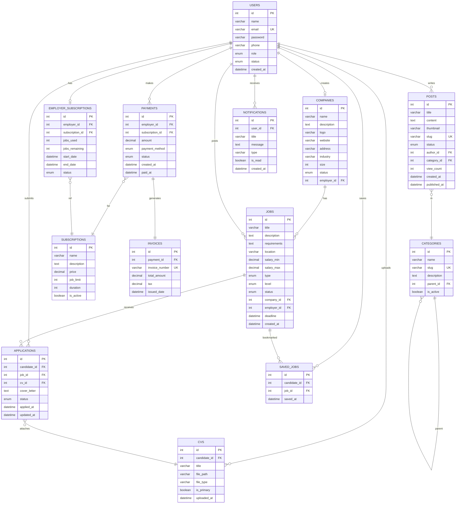
```mermaid
erDiagram
USERS {
    int id PK
    varchar name
    varchar email UK
    varchar password
    varchar phone
    enum role
    enum status
    datetime created_at
}
COMPANIES {
    int id PK
    varchar name
    text description
    varchar logo
    varchar website
    varchar address
    varchar industry
    int size
    enum status
    int employer_id FK
}
JOBS {
    int id PK
    varchar title
    text description
    text requirements
    varchar location
    decimal salary_min
    decimal salary_max
    enum type
    enum level
    enum status
    int company_id FK
    int employer_id FK
    datetime deadline
    datetime created_at
}
APPLICATIONS {
    int id PK
    int candidate_id FK
    int job_id FK
    int cv_id FK
    text cover_letter
    enum status
    datetime applied_at
    datetime updated_at
}
CVS {
    int id PK
    int candidate_id FK
    varchar title
    varchar file_path
    varchar file_type
    boolean is_primary
    datetime uploaded_at
}
SAVED_JOBS {
    int id PK
    int candidate_id FK
    int job_id FK
    datetime saved_at
}
SUBSCRIPTIONS {
    int id PK
    varchar name
    text description
    decimal price
    int job_limit
    int duration
    boolean is_active
}
PAYMENTS {
    int id PK
    int employer_id FK
    int subscription_id FK
    decimal amount
    enum payment_method
    enum status
    datetime created_at
    datetime paid_at
}
INVOICES {
    int id PK
    int payment_id FK
    varchar invoice_number UK
    decimal total_amount
    decimal tax
    datetime issued_date
}
EMPLOYER_SUBSCRIPTIONS {
    int id PK
    int employer_id FK
    int subscription_id FK
    int jobs_used
    int jobs_remaining
    datetime start_date
    datetime end_date
    enum status
}
POSTS {
    int id PK
    varchar title
    text content
    varchar thumbnail
    varchar slug UK
    enum status
    int author_id FK
    int category_id FK
    int view_count
    datetime created_at
    datetime published_at
}
CATEGORIES {
    int id PK
    varchar name
    varchar slug UK
    text description
    int parent_id FK
    boolean is_active
}
NOTIFICATIONS {
    int id PK
    int user_id FK
    varchar title
    text message
    varchar type
    boolean is_read
    datetime created_at
}
USERS ||--o| COMPANIES : "creates"
COMPANIES ||--o{ JOBS : "has"
USERS ||--o{ JOBS : "posts"
USERS ||--o{ APPLICATIONS : "submits"
JOBS ||--o{ APPLICATIONS : "receives"
USERS ||--o{ CVS : "uploads"
APPLICATIONS }o--|| CVS : "attaches"
USERS ||--o{ SAVED_JOBS : "saves"
JOBS ||--o{ SAVED_JOBS : "bookmarked"
USERS ||--o{ PAYMENTS : "makes"
PAYMENTS }o--|| SUBSCRIPTIONS : "for"
PAYMENTS ||--|| INVOICES : "generates"
USERS ||--o| EMPLOYER_SUBSCRIPTIONS : "has"
EMPLOYER_SUBSCRIPTIONS }o--|| SUBSCRIPTIONS : "ref"
USERS ||--o{ POSTS : "writes"
POSTS }o--|| CATEGORIES : "in"
CATEGORIES ||--o{ CATEGORIES : "parent"
USERS ||--o{ NOTIFICATIONS : "receives"
```

#### Danh sách 13 bảng

| STT | Bảng | Mô tả | Số cột | FK |
|-----|------|-------|--------|-----|
| 1 | `users` | Tất cả người dùng | 9 | — |
| 2 | `companies` | Thông tin công ty | 11 | employer_id |
| 3 | `jobs` | Tin tuyển dụng | 14 | company_id, employer_id |
| 4 | `applications` | Đơn ứng tuyển | 8 | candidate_id, job_id, cv_id |
| 5 | `cvs` | File CV | 7 | candidate_id |
| 6 | `saved_jobs` | Việc làm đã lưu | 4 | candidate_id, job_id |
| 7 | `subscriptions` | Gói dịch vụ | 7 | — |
| 8 | `payments` | Giao dịch | 8 | employer_id, subscription_id |
| 9 | `invoices` | Hóa đơn | 6 | payment_id |
| 10 | `employer_subscriptions` | Gói active | 8 | employer_id, subscription_id |
| 11 | `posts` | Bài viết blog | 11 | author_id, category_id |
| 12 | `categories` | Danh mục | 6 | parent_id (self) |
| 13 | `notifications` | Thông báo | 7 | user_id |

---

### 8.2 Enums

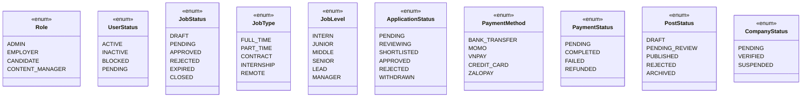
```mermaid
classDiagram
class Role {
<<enum>>
ADMIN
EMPLOYER
CANDIDATE
CONTENT_MANAGER
}
class UserStatus {
<<enum>>
ACTIVE
INACTIVE
BLOCKED
PENDING
}
class JobStatus {
<<enum>>
DRAFT
PENDING
APPROVED
REJECTED
EXPIRED
CLOSED
}
class JobType {
<<enum>>
FULL_TIME
PART_TIME
CONTRACT
INTERNSHIP
REMOTE
}
class JobLevel {
<<enum>>
INTERN
JUNIOR
MIDDLE
SENIOR
LEAD
MANAGER
}
class ApplicationStatus {
<<enum>>
PENDING
REVIEWING
SHORTLISTED
APPROVED
REJECTED
WITHDRAWN
}
class PaymentMethod {
<<enum>>
BANK_TRANSFER
MOMO
VNPAY
CREDIT_CARD
ZALOPAY
}
class PaymentStatus {
<<enum>>
PENDING
COMPLETED
FAILED
REFUNDED
}
class PostStatus {
<<enum>>
DRAFT
PENDING_REVIEW
PUBLISHED
REJECTED
ARCHIVED
}
class CompanyStatus {
<<enum>>
PENDING
VERIFIED
SUSPENDED
}
```

#### Chi tiết giá trị Enum

| Enum | Giá trị | Mô tả |
|------|---------|-------|
| **Role** | ADMIN | Quản trị viên |
| | EMPLOYER | Nhà tuyển dụng |
| | CANDIDATE | Ứng viên |
| | CONTENT_MANAGER | Người quản lý nội dung |
| **JobStatus** | DRAFT | Bản nháp, chưa gửi duyệt |
| | PENDING | Chờ Admin duyệt |
| | APPROVED | Đã duyệt, hiển thị công khai |
| | REJECTED | Bị từ chối |
| | EXPIRED | Quá deadline |
| | CLOSED | Employer đóng |
| **ApplicationStatus** | PENDING | Chờ xem xét |
| | REVIEWING | Đang xem xét |
| | SHORTLISTED | Vào danh sách ngắn |
| | APPROVED | Đã duyệt |
| | REJECTED | Bị từ chối |
| | WITHDRAWN | Ứng viên rút đơn |
| **PaymentMethod** | BANK_TRANSFER | Chuyển khoản ngân hàng |
| | MOMO | Ví MoMo |
| | VNPAY | VNPay |
| | CREDIT_CARD | Thẻ tín dụng |
| | ZALOPAY | ZaloPay |
| **PostStatus** | DRAFT | Bản nháp |
| | PENDING_REVIEW | Chờ Admin duyệt |
| | PUBLISHED | Đã xuất bản |
| | REJECTED | Bị từ chối |
| | ARCHIVED | Đã lưu trữ |

---

### 8.3 SQL DDL — Hoàn chỉnh 13 bảng

```sql
CREATE DATABASE IF NOT EXISTS vinjobs
    CHARACTER SET utf8mb4 COLLATE utf8mb4_unicode_ci;
USE vinjobs;

-- 1. USERS
CREATE TABLE users (
    id INT PRIMARY KEY AUTO_INCREMENT,
    name VARCHAR(100) NOT NULL,
    email VARCHAR(150) UNIQUE NOT NULL,
    password VARCHAR(255) NOT NULL,
    phone VARCHAR(20),
    avatar VARCHAR(500),
    role ENUM('ADMIN','EMPLOYER','CANDIDATE','CONTENT_MANAGER') NOT NULL,
    status ENUM('ACTIVE','INACTIVE','BLOCKED','PENDING') DEFAULT 'PENDING',
    created_at DATETIME DEFAULT CURRENT_TIMESTAMP
);

-- 2. COMPANIES
CREATE TABLE companies (
    id INT PRIMARY KEY AUTO_INCREMENT,
    name VARCHAR(200) NOT NULL,
    description TEXT,
    logo VARCHAR(500),
    website VARCHAR(300),
    address VARCHAR(500),
    industry VARCHAR(100),
    size INT DEFAULT 0,
    status ENUM('PENDING','VERIFIED','SUSPENDED') DEFAULT 'PENDING',
    employer_id INT UNIQUE NOT NULL,
    created_at DATETIME DEFAULT CURRENT_TIMESTAMP,
    FOREIGN KEY (employer_id) REFERENCES users(id) ON DELETE CASCADE
);

-- 3. SUBSCRIPTIONS
CREATE TABLE subscriptions (
    id INT PRIMARY KEY AUTO_INCREMENT,
    name VARCHAR(50) NOT NULL,
    description TEXT,
    price DECIMAL(12,2) NOT NULL,
    job_limit INT NOT NULL DEFAULT 0,
    duration INT NOT NULL,
    is_active BOOLEAN DEFAULT TRUE
);

INSERT INTO subscriptions (name, description, price, job_limit, duration) VALUES
('Basic', 'Gói cơ bản - 5 bài/30 ngày', 200000.00, 5, 30),
('Premium', 'Gói cao cấp - 20 bài/60 ngày', 500000.00, 20, 60),
('Enterprise', 'Gói DN - Không giới hạn', 2000000.00, 0, 365);

-- 4. PAYMENTS
CREATE TABLE payments (
    id INT PRIMARY KEY AUTO_INCREMENT,
    employer_id INT NOT NULL,
    subscription_id INT NOT NULL,
    amount DECIMAL(12,2) NOT NULL,
    payment_method ENUM('BANK_TRANSFER','MOMO','VNPAY','CREDIT_CARD','ZALOPAY') NOT NULL,
    status ENUM('PENDING','COMPLETED','FAILED','REFUNDED') DEFAULT 'PENDING',
    created_at DATETIME DEFAULT CURRENT_TIMESTAMP,
    paid_at DATETIME,
    FOREIGN KEY (employer_id) REFERENCES users(id),
    FOREIGN KEY (subscription_id) REFERENCES subscriptions(id)
);

-- 5. INVOICES
CREATE TABLE invoices (
    id INT PRIMARY KEY AUTO_INCREMENT,
    payment_id INT UNIQUE NOT NULL,
    invoice_number VARCHAR(50) UNIQUE NOT NULL,
    total_amount DECIMAL(12,2) NOT NULL,
    tax DECIMAL(12,2) DEFAULT 0.00,
    issued_date DATETIME DEFAULT CURRENT_TIMESTAMP,
    FOREIGN KEY (payment_id) REFERENCES payments(id)
);

-- 6. EMPLOYER_SUBSCRIPTIONS
CREATE TABLE employer_subscriptions (
    id INT PRIMARY KEY AUTO_INCREMENT,
    employer_id INT NOT NULL,
    subscription_id INT NOT NULL,
    jobs_used INT DEFAULT 0,
    jobs_remaining INT NOT NULL,
    start_date DATETIME NOT NULL,
    end_date DATETIME NOT NULL,
    status ENUM('ACTIVE','EXPIRED','CANCELLED') DEFAULT 'ACTIVE',
    FOREIGN KEY (employer_id) REFERENCES users(id),
    FOREIGN KEY (subscription_id) REFERENCES subscriptions(id)
);

-- 7. JOBS
CREATE TABLE jobs (
    id INT PRIMARY KEY AUTO_INCREMENT,
    title VARCHAR(200) NOT NULL,
    description TEXT NOT NULL,
    requirements TEXT,
    location VARCHAR(200),
    salary_min DECIMAL(12,2),
    salary_max DECIMAL(12,2),
    type ENUM('FULL_TIME','PART_TIME','CONTRACT','INTERNSHIP','REMOTE') DEFAULT 'FULL_TIME',
    level ENUM('INTERN','JUNIOR','MIDDLE','SENIOR','LEAD','MANAGER') DEFAULT 'JUNIOR',
    status ENUM('DRAFT','PENDING','APPROVED','REJECTED','EXPIRED','CLOSED') DEFAULT 'DRAFT',
    company_id INT NOT NULL,
    employer_id INT NOT NULL,
    deadline DATETIME,
    created_at DATETIME DEFAULT CURRENT_TIMESTAMP,
    FOREIGN KEY (company_id) REFERENCES companies(id),
    FOREIGN KEY (employer_id) REFERENCES users(id)
);

-- 8. CVS
CREATE TABLE cvs (
    id INT PRIMARY KEY AUTO_INCREMENT,
    candidate_id INT NOT NULL,
    title VARCHAR(200) NOT NULL,
    file_path VARCHAR(500) NOT NULL,
    file_type VARCHAR(20) DEFAULT 'PDF',
    is_primary BOOLEAN DEFAULT FALSE,
    uploaded_at DATETIME DEFAULT CURRENT_TIMESTAMP,
    FOREIGN KEY (candidate_id) REFERENCES users(id)
);

-- 9. APPLICATIONS
CREATE TABLE applications (
    id INT PRIMARY KEY AUTO_INCREMENT,
    candidate_id INT NOT NULL,
    job_id INT NOT NULL,
    cv_id INT NOT NULL,
    cover_letter TEXT,
    status ENUM('PENDING','REVIEWING','SHORTLISTED','APPROVED','REJECTED','WITHDRAWN') DEFAULT 'PENDING',
    applied_at DATETIME DEFAULT CURRENT_TIMESTAMP,
    updated_at DATETIME DEFAULT CURRENT_TIMESTAMP ON UPDATE CURRENT_TIMESTAMP,
    UNIQUE KEY (candidate_id, job_id),
    FOREIGN KEY (candidate_id) REFERENCES users(id),
    FOREIGN KEY (job_id) REFERENCES jobs(id),
    FOREIGN KEY (cv_id) REFERENCES cvs(id)
);

-- 10. SAVED_JOBS
CREATE TABLE saved_jobs (
    id INT PRIMARY KEY AUTO_INCREMENT,
    candidate_id INT NOT NULL,
    job_id INT NOT NULL,
    saved_at DATETIME DEFAULT CURRENT_TIMESTAMP,
    UNIQUE KEY (candidate_id, job_id),
    FOREIGN KEY (candidate_id) REFERENCES users(id),
    FOREIGN KEY (job_id) REFERENCES jobs(id)
);

-- 11. CATEGORIES
CREATE TABLE categories (
    id INT PRIMARY KEY AUTO_INCREMENT,
    name VARCHAR(100) NOT NULL,
    slug VARCHAR(100) UNIQUE NOT NULL,
    description TEXT,
    parent_id INT,
    is_active BOOLEAN DEFAULT TRUE,
    FOREIGN KEY (parent_id) REFERENCES categories(id)
);

-- 12. POSTS
CREATE TABLE posts (
    id INT PRIMARY KEY AUTO_INCREMENT,
    title VARCHAR(300) NOT NULL,
    content TEXT NOT NULL,
    thumbnail VARCHAR(500),
    slug VARCHAR(300) UNIQUE NOT NULL,
    status ENUM('DRAFT','PENDING_REVIEW','PUBLISHED','REJECTED','ARCHIVED') DEFAULT 'DRAFT',
    author_id INT NOT NULL,
    category_id INT,
    view_count INT DEFAULT 0,
    created_at DATETIME DEFAULT CURRENT_TIMESTAMP,
    published_at DATETIME,
    FOREIGN KEY (author_id) REFERENCES users(id),
    FOREIGN KEY (category_id) REFERENCES categories(id)
);

-- 13. NOTIFICATIONS
CREATE TABLE notifications (
    id INT PRIMARY KEY AUTO_INCREMENT,
    user_id INT NOT NULL,
    title VARCHAR(200) NOT NULL,
    message TEXT NOT NULL,
    type VARCHAR(50) NOT NULL,
    is_read BOOLEAN DEFAULT FALSE,
    created_at DATETIME DEFAULT CURRENT_TIMESTAMP,
    FOREIGN KEY (user_id) REFERENCES users(id)
);

-- INDEXES
CREATE INDEX idx_jobs_company ON jobs(company_id);
CREATE INDEX idx_jobs_status ON jobs(status);
CREATE INDEX idx_jobs_employer ON jobs(employer_id);
CREATE INDEX idx_applications_candidate ON applications(candidate_id);
CREATE INDEX idx_applications_job ON applications(job_id);
CREATE INDEX idx_payments_employer ON payments(employer_id);
CREATE INDEX idx_posts_author ON posts(author_id);
CREATE INDEX idx_posts_status ON posts(status);
CREATE INDEX idx_notifications_user ON notifications(user_id);
CREATE INDEX idx_notifications_read ON notifications(is_read);
```

---

## 9. Design Patterns

### 9.1 Singleton — DatabaseConnection

**Vấn đề:** Hệ thống có nhiều module (User, Job, Payment, Blog, Notification), mỗi module cần kết nối database. Nếu mỗi module tạo connection riêng sẽ lãng phí tài nguyên.

**Giải pháp:** Dùng Singleton để đảm bảo toàn bộ hệ thống chỉ tạo đúng **1 instance** kết nối database.

#### Class Diagram

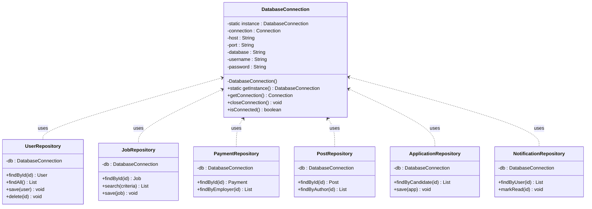
```mermaid
classDiagram
class DatabaseConnection {
-static instance : DatabaseConnection
-connection : Connection
-host : String
-port : String
-database : String
-username : String
-password : String
-DatabaseConnection()
+static getInstance() DatabaseConnection
+getConnection() Connection
+closeConnection() void
+isConnected() boolean
}
class UserRepository {
-db : DatabaseConnection
+findById(id) User
+findAll() List
+save(user) void
+delete(id) void
}
class JobRepository {
-db : DatabaseConnection
+findById(id) Job
+search(criteria) List
+save(job) void
}
class PaymentRepository {
-db : DatabaseConnection
+findById(id) Payment
+findByEmployer(id) List
}
class PostRepository {
-db : DatabaseConnection
+findById(id) Post
+findByAuthor(id) List
}
class ApplicationRepository {
-db : DatabaseConnection
+findByCandidate(id) List
+save(app) void
}
class NotificationRepository {
-db : DatabaseConnection
+findByUser(id) List
+markRead(id) void
}
DatabaseConnection <.. UserRepository : uses
DatabaseConnection <.. JobRepository : uses
DatabaseConnection <.. PaymentRepository : uses
DatabaseConnection <.. PostRepository : uses
DatabaseConnection <.. ApplicationRepository : uses
DatabaseConnection <.. NotificationRepository : uses
```

> [!NOTE]
> Constructor PRIVATE, getInstance() synchronized. Đảm bảo 1 instance duy nhất.

#### Code Java

```java
public class DatabaseConnection {
    // Biến static — lưu instance duy nhất
    private static DatabaseConnection instance;
    private Connection connection;
    private String host = "localhost";
    private String database = "vinjobs";

    // Constructor PRIVATE — không thể gọi từ bên ngoài
    private DatabaseConnection() {
        try {
            String url = "jdbc:mysql://" + host + ":3306/" + database;
            this.connection = DriverManager.getConnection(url, "root", "password");
            System.out.println("Kết nối database thành công");
        } catch (SQLException e) {
            throw new RuntimeException("Không thể kết nối database", e);
        }
    }

    // Phương thức static — điểm truy cập duy nhất
    // synchronized — đảm bảo thread-safe trong môi trường đa luồng
    public static synchronized DatabaseConnection getInstance() {
        if (instance == null) {
            instance = new DatabaseConnection();
        }
        return instance;
    }

    public Connection getConnection() {
        return this.connection;
    }

    public boolean isConnected() {
        try { return connection != null && !connection.isClosed(); }
        catch (SQLException e) { return false; }
    }

    public void closeConnection() {
        try { if (connection != null) connection.close(); }
        catch (SQLException e) { e.printStackTrace(); }
    }
}

// === Sử dụng ===
DatabaseConnection db1 = DatabaseConnection.getInstance();
DatabaseConnection db2 = DatabaseConnection.getInstance();
System.out.println(db1 == db2);  // true — cùng 1 object
```

---

### 9.2 Facade — RecruitmentFacade

**Vấn đề:** Khi Employer mua gói dịch vụ, client phải gọi lần lượt AuthService, SubscriptionService, PaymentService, NotificationService — phức tạp và dễ sai thứ tự.

**Giải pháp:** Tạo RecruitmentFacade gom tất cả service, cung cấp **1 phương thức đơn giản** cho mỗi tác vụ phức tạp.

#### Class Diagram

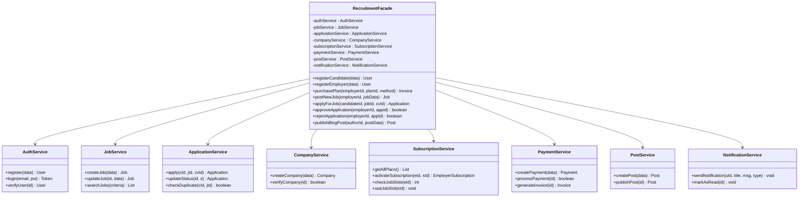
```mermaid
classDiagram
class RecruitmentFacade {
-authService : AuthService
-jobService : JobService
-applicationService : ApplicationService
-companyService : CompanyService
-subscriptionService : SubscriptionService
-paymentService : PaymentService
-postService : PostService
-notificationService : NotificationService
+registerCandidate(data) User
+registerEmployer(data) User
+purchasePlan(employerId, planId, method) Invoice
+postNewJob(employerId, jobData) Job
+applyForJob(candidateId, jobId, cvId) Application
+approveApplication(employerId, appId) boolean
+rejectApplication(employerId, appId) boolean
+publishBlogPost(authorId, postData) Post
}
class AuthService {
+register(data) User
+login(email, pw) Token
+verifyUser(id) User
}
class JobService {
+createJob(data) Job
+updateJob(id, data) Job
+searchJobs(criteria) List
}
class ApplicationService {
+apply(cId, jId, cvId) Application
+updateStatus(id, s) Application
+checkDuplicate(cId, jId) boolean
}
class CompanyService {
+createCompany(data) Company
+verifyCompany(id) boolean
}
class SubscriptionService {
+getAllPlans() List
+activateSubscription(eId, sId) EmployerSubscription
+checkJobSlots(eId) int
+useJobSlot(eId) void
}
class PaymentService {
+createPayment(data) Payment
+processPayment(id) boolean
+generateInvoice(id) Invoice
}
class PostService {
+createPost(data) Post
+publishPost(id) Post
}
class NotificationService {
+sendNotification(uId, title, msg, type) void
+markAsRead(id) void
}
RecruitmentFacade --> AuthService
RecruitmentFacade --> JobService
RecruitmentFacade --> ApplicationService
RecruitmentFacade --> CompanyService
RecruitmentFacade --> SubscriptionService
RecruitmentFacade --> PaymentService
RecruitmentFacade --> PostService
RecruitmentFacade --> NotificationService
```

#### Code Java — purchasePlan() & applyForJob()

```java
public class RecruitmentFacade {
    private AuthService authService;
    private SubscriptionService subscriptionService;
    private PaymentService paymentService;
    private NotificationService notificationService;
    // ... các service khác

    public Invoice purchasePlan(int employerId, int planId, PaymentMethod method) {
        // Bước 1: Kiểm tra employer hợp lệ
        User employer = authService.verifyUser(employerId);
        if (employer.getRole() != Role.EMPLOYER)
            throw new UnauthorizedException("Chỉ employer mới được mua gói");

        // Bước 2: Lấy thông tin gói
        Subscription plan = subscriptionService.getPlanById(planId);

        // Bước 3: Tạo payment
        Payment payment = paymentService.createPayment(
            new PaymentData(employerId, planId, plan.getPrice(), method));

        // Bước 4: Xử lý thanh toán
        boolean success = paymentService.processPayment(payment.getId());
        if (!success) throw new PaymentFailedException("Thanh toán thất bại");

        // Bước 5: Kích hoạt subscription
        subscriptionService.activateSubscription(employerId, planId);

        // Bước 6: Tạo hóa đơn
        Invoice invoice = paymentService.generateInvoice(payment.getId());

        // Bước 7: Gửi thông báo
        notificationService.sendNotification(employerId,
            "Mua gói thành công", "Đã kích hoạt gói " + plan.getName(),
            "PAYMENT_SUCCESS");

        return invoice;
    }

    public Application applyForJob(int candidateId, int jobId, int cvId) {
        User candidate = authService.verifyUser(candidateId);
        Job job = jobService.getJobById(jobId);
        if (job.isExpired()) throw new JobExpiredException("Job đã hết hạn");
        if (applicationService.checkDuplicate(candidateId, jobId))
            throw new DuplicateException("Đã ứng tuyển rồi");
        Application app = applicationService.apply(candidateId, jobId, cvId);
        notificationService.sendNotification(job.getEmployerId(),
            "Có ứng viên mới", candidate.getName() + " đã ứng tuyển",
            "NEW_APPLICATION");
        return app;
    }
}

// === Client chỉ cần 1 dòng ===
RecruitmentFacade facade = new RecruitmentFacade(...);
Invoice inv = facade.purchasePlan(employerId, 2, PaymentMethod.MOMO);
Application app = facade.applyForJob(candidateId, jobId, cvId);
```

#### So sánh

| Tiêu chí | Không dùng Facade | Dùng Facade |
|----------|-------------------|-------------|
| Số lệnh gọi | Client gọi 7 service riêng | Client gọi 1 method |
| Thứ tự | Client phải biết thứ tự đúng | Facade xử lý điều phối |
| Coupling | Cao — client phụ thuộc 7 service | Thấp — client chỉ biết Facade |
| Bảo trì | Thay đổi 1 service ảnh hưởng client | Chỉ sửa trong Facade |
| Lỗi | Dễ quên bước, sai thứ tự | Logic tập trung, ít lỗi |

---

### 9.3 Bridge — Notification System

**Vấn đề:** Hệ thống có 5 loại thông báo (JobApproved, PaymentSuccess, Application, ApplicationStatus, PostApproved) và 3 kênh gửi (Email, SMS, Push). Nếu tạo class cho mỗi tổ hợp sẽ cần **5 × 3 = 15 class**.

**Giải pháp:** Dùng Bridge tách "loại thông báo" (Abstraction) khỏi "kênh gửi" (Implementation). Chỉ cần **5 + 3 = 8 class**.

#### Ma trận kết hợp

| Loại thông báo \ Kênh | EmailSender | SmsSender | PushSender |
|------------------------|-------------|-----------|------------|
| JobApprovedNotification | ✓ | ✓ | ✓ |
| PaymentSuccessNotification | ✓ | ✓ | ✓ |
| ApplicationNotification | ✓ | ✓ | ✓ |
| ApplicationStatusNotification | ✓ | ✓ | ✓ |
| PostApprovedNotification | ✓ | ✓ | ✓ |

> 15 tổ hợp nhưng chỉ cần **8 class** (5 Notification + 3 Sender).

#### Code Java

```java
// === INTERFACE: MessageSender (Implementation) ===
public interface MessageSender {
    boolean sendMessage(String to, String title, String body);
    String getSenderType();
}

public class EmailSender implements MessageSender {
    private String smtpHost = "smtp.gmail.com";
    private int smtpPort = 587;

    @Override
    public boolean sendMessage(String to, String title, String body) {
        System.out.println("[EMAIL] -> " + to + ": " + title);
        // Gửi email qua SMTP
        return true;
    }
    public String getSenderType() { return "EMAIL"; }
}

public class SmsSender implements MessageSender {
    private String apiKey;
    @Override
    public boolean sendMessage(String to, String title, String body) {
        System.out.println("[SMS] -> " + to + ": " + title);
        return true;
    }
    public String getSenderType() { return "SMS"; }
}

public class PushSender implements MessageSender {
    private String fcmToken;
    @Override
    public boolean sendMessage(String to, String title, String body) {
        System.out.println("[PUSH] -> " + to + ": " + title);
        return true;
    }
    public String getSenderType() { return "PUSH"; }
}

// === ABSTRACT CLASS: Notification (Abstraction) ===
public abstract class Notification {
    protected int id;
    protected String title;
    protected String message;
    protected int userId;
    protected MessageSender sender;  // BRIDGE — tham chiếu đến implementation

    public Notification(MessageSender sender) {
        this.sender = sender;
    }

    public abstract void send();
}

// === CONCRETE: PaymentSuccessNotification ===
public class PaymentSuccessNotification extends Notification {
    private Payment payment;
    private Subscription plan;

    public PaymentSuccessNotification(MessageSender sender,
                                       Payment payment, Subscription plan) {
        super(sender);
        this.payment = payment;
        this.plan = plan;
    }

    @Override
    public void send() {
        String contact = getUserContact(payment.getEmployerId());
        this.title = "Thanh toán thành công";
        this.message = "Bạn đã mua gói " + plan.getName()
            + ". Số tiền: " + payment.getAmount() + " VNĐ";
        sender.sendMessage(contact, this.title, this.message);
    }
}

// === Sử dụng ===
// Gửi qua email
Notification n1 = new PaymentSuccessNotification(
    new EmailSender(), payment, plan);
n1.send();  // [EMAIL] -> employer@gmail.com: Thanh toán thành công

// Gửi qua SMS — chỉ cần đổi sender
Notification n2 = new PaymentSuccessNotification(
    new SmsSender(), payment, plan);
n2.send();  // [SMS] -> 0901234567: Thanh toán thành công

// Gửi push notification
Notification n3 = new PaymentSuccessNotification(
    new PushSender(), payment, plan);
n3.send();  // [PUSH] -> fcm_token: Thanh toán thành công
```

#### So sánh

| Tiêu chí | Không dùng Bridge | Dùng Bridge |
|----------|-------------------|-------------|
| Số class | 5 × 3 = 15 class | 5 + 3 = 8 class |
| Thêm kênh mới | Thêm 5 class | Thêm 1 class (implement MessageSender) |
| Thêm loại mới | Thêm 3 class | Thêm 1 class (extend Notification) |
| Mở rộng | Class explosion | Linh hoạt, dễ mở rộng |

---

## 10. Sequence Diagrams

### 10.1 Mua gói dịch vụ

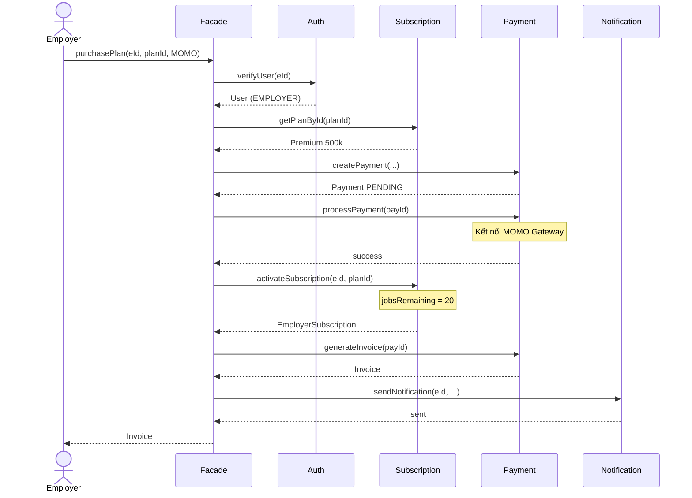
```mermaid
sequenceDiagram
actor E as Employer
participant F as Facade
participant AUTH as Auth
participant SUB as Subscription
participant PAY as Payment
participant N as Notification
E->>F: purchasePlan(eId, planId, MOMO)
F->>AUTH: verifyUser(eId)
AUTH-->>F: User (EMPLOYER)
F->>SUB: getPlanById(planId)
SUB-->>F: Premium 500k
F->>PAY: createPayment(...)
PAY-->>F: Payment PENDING
F->>PAY: processPayment(payId)
Note over PAY: Kết nối MOMO Gateway
PAY-->>F: success
F->>SUB: activateSubscription(eId, planId)
Note over SUB: jobsRemaining = 20
SUB-->>F: EmployerSubscription
F->>PAY: generateInvoice(payId)
PAY-->>F: Invoice
F->>N: sendNotification(eId, ...)
N-->>F: sent
F-->>E: Invoice
```

---

### 10.2 Ứng tuyển

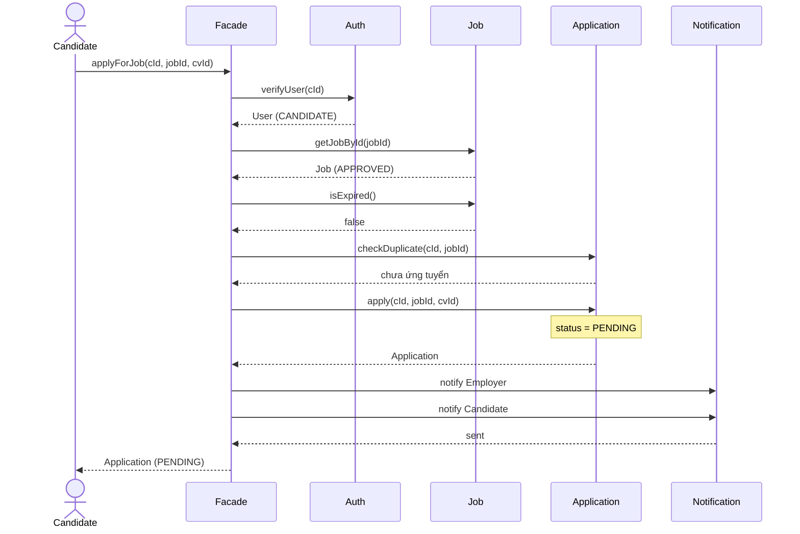
```mermaid
sequenceDiagram
actor C as Candidate
participant F as Facade
participant AUTH as Auth
participant JOB as Job
participant APP as Application
participant N as Notification
C->>F: applyForJob(cId, jobId, cvId)
F->>AUTH: verifyUser(cId)
AUTH-->>F: User (CANDIDATE)
F->>JOB: getJobById(jobId)
JOB-->>F: Job (APPROVED)
F->>JOB: isExpired()
JOB-->>F: false
F->>APP: checkDuplicate(cId, jobId)
APP-->>F: chưa ứng tuyển
F->>APP: apply(cId, jobId, cvId)
Note over APP: status = PENDING
APP-->>F: Application
F->>N: notify Employer
F->>N: notify Candidate
N-->>F: sent
F-->>C: Application (PENDING)
```

---

### 10.3 Đăng tin tuyển dụng

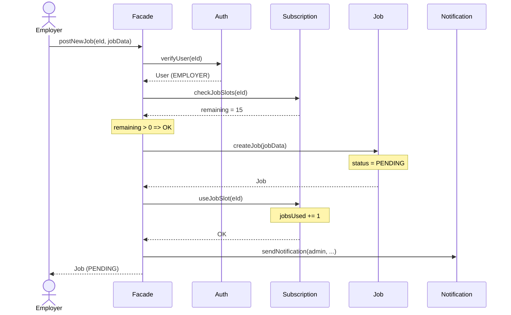
```mermaid
sequenceDiagram
actor E as Employer
participant F as Facade
participant AUTH as Auth
participant SUB as Subscription
participant JOB as Job
participant N as Notification
E->>F: postNewJob(eId, jobData)
F->>AUTH: verifyUser(eId)
AUTH-->>F: User (EMPLOYER)
F->>SUB: checkJobSlots(eId)
SUB-->>F: remaining = 15
Note over F: remaining > 0 => OK
F->>JOB: createJob(jobData)
Note over JOB: status = PENDING
JOB-->>F: Job
F->>SUB: useJobSlot(eId)
Note over SUB: jobsUsed += 1
SUB-->>F: OK
F->>N: sendNotification(admin, ...)
F-->>E: Job (PENDING)
```

---

### 10.4 Đăng ký tài khoản

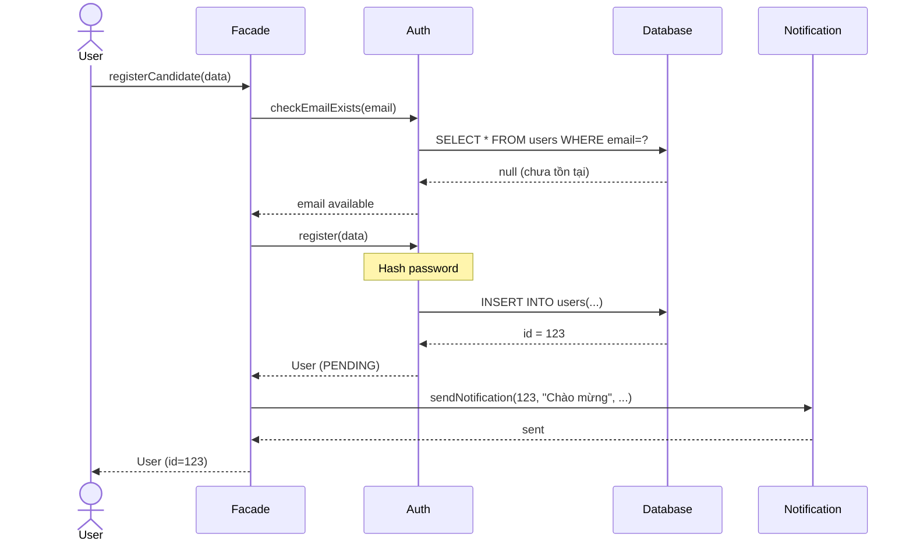
```mermaid
sequenceDiagram
actor U as User
participant F as Facade
participant AUTH as Auth
participant DB as Database
participant N as Notification
U->>F: registerCandidate(data)
F->>AUTH: checkEmailExists(email)
AUTH->>DB: SELECT * FROM users WHERE email=?
DB-->>AUTH: null (chưa tồn tại)
AUTH-->>F: email available
F->>AUTH: register(data)
Note over AUTH: Hash password
AUTH->>DB: INSERT INTO users(...)
DB-->>AUTH: id = 123
AUTH-->>F: User (PENDING)
F->>N: sendNotification(123, "Chào mừng", ...)
N-->>F: sent
F-->>U: User (id=123)
```

---

### 10.5 Singleton — DatabaseConnection

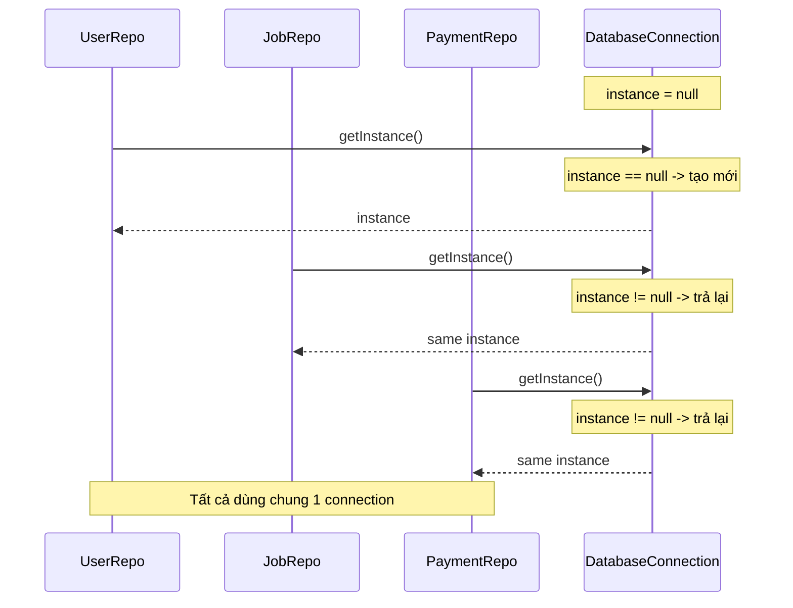
```mermaid
sequenceDiagram
participant U as UserRepo
participant J as JobRepo
participant P as PaymentRepo
participant DB as DatabaseConnection
Note over DB: instance = null
U->>DB: getInstance()
Note over DB: instance == null -> tạo mới
DB-->>U: instance
J->>DB: getInstance()
Note over DB: instance != null -> trả lại
DB-->>J: same instance
P->>DB: getInstance()
Note over DB: instance != null -> trả lại
DB-->>P: same instance
Note over U,P: Tất cả dùng chung 1 connection
```

---

### 10.6 Bridge — Gửi đa kênh

```mermaid
sequenceDiagram
participant SYS as System
participant N as PaymentNotification
participant E as EmailSender
participant S as SmsSender
participant P as PushSender
Note over SYS: Employer thanh toán xong
SYS->>N: new(EmailSender, payment, plan)
SYS->>N: send()
N->>E: sendMessage(email, title, body)
E-->>N: sent
SYS->>N: new(SmsSender, payment, plan)
SYS->>N: send()
N->>S: sendMessage(phone, title, body)
S-->>N: sent
SYS->>N: new(PushSender, payment, plan)
SYS->>N: send()
N->>P: sendMessage(token, title, body)
P-->>N: sent
Note over SYS,P: Cùng notification, 3 kênh khác nhau
```

---

## 11. State Diagrams

### 11.1 Application — Vòng đời đơn ứng tuyển

```mermaid
stateDiagram-v2
[*] --> PENDING : Candidate gửi đơn
PENDING --> REVIEWING : Employer xem
REVIEWING --> SHORTLISTED : Employer chọn
REVIEWING --> REJECTED : Employer từ chối
SHORTLISTED --> APPROVED : Employer duyệt
SHORTLISTED --> REJECTED : Employer từ chối
PENDING --> WITHDRAWN : Candidate rút đơn
REVIEWING --> WITHDRAWN : Candidate rút đơn
APPROVED --> [*]
REJECTED --> [*]
WITHDRAWN --> [*]
```

---

### 11.2 Job — Vòng đời tin tuyển dụng

```mermaid
stateDiagram-v2
[*] --> DRAFT : Employer tạo
DRAFT --> PENDING : Employer gửi duyệt
PENDING --> APPROVED : Admin duyệt
PENDING --> REJECTED : Admin từ chối
REJECTED --> DRAFT : Employer sửa lại
APPROVED --> EXPIRED : Quá deadline
APPROVED --> CLOSED : Employer đóng
EXPIRED --> [*]
CLOSED --> [*]
```

---

### 11.3 Post — Vòng đời bài viết blog

```mermaid
stateDiagram-v2
[*] --> DRAFT : CM tạo bài
DRAFT --> PENDING_REVIEW : CM gửi duyệt
PENDING_REVIEW --> PUBLISHED : Admin duyệt
PENDING_REVIEW --> REJECTED : Admin từ chối
REJECTED --> DRAFT : CM sửa lại
PUBLISHED --> ARCHIVED : CM lưu trữ
ARCHIVED --> PUBLISHED : CM khôi phục
ARCHIVED --> [*]
```

---

## 12. Activity Diagrams

### 12.1 Flow ứng tuyển

```mermaid
flowchart TD
A([Candidate bắt đầu]) --> B{Đã đăng nhập?}
B -->|Không| C[Đăng nhập / Đăng ký]
C --> B
B -->|Có| D[Tìm kiếm việc làm]
D --> E[Xem chi tiết job]
E --> F{Job còn hạn?}
F -->|Không| G[Hiển thị hết hạn]
G --> D
F -->|Có| H{Đã ứng tuyển?}
H -->|Có| I[Hiển thị đã ứng tuyển]
I --> D
H -->|Không| J[Chọn CV]
J --> K{Có CV?}
K -->|Không| L[Upload CV mới]
L --> J
K -->|Có| M[Viết cover letter]
M --> N[Gửi đơn ứng tuyển]
N --> O[Tạo Application PENDING]
O --> P[Gửi thông báo cho Employer]
P --> Q([Kết thúc])
```

---

### 12.2 Flow mua gói

```mermaid
flowchart TD
A([Employer bắt đầu]) --> B{Đã có công ty?}
B -->|Không| C[Tạo công ty]
C --> B
B -->|Có| D[Xem danh sách gói]
D --> E[Chọn gói dịch vụ]
E --> F[Chọn phương thức thanh toán]
F --> G[Tạo Payment PENDING]
G --> H[Xử lý thanh toán]
H --> I{Thanh toán OK?}
I -->|Không| J[Hiển thị lỗi]
J --> F
I -->|Có| K[Kích hoạt Subscription]
K --> L[Tạo Invoice]
L --> M[Gửi thông báo]
M --> N([Employer có thể đăng tin])
```

---

## 13. Tổng kết

### Bảng tổng hợp

| Hạng mục | Số lượng | Chi tiết |
|----------|---------|---------|
| **Tổng class** | 25+ | User hierarchy, Recruitment, Payment, Blog, Notification, Service, Repository |
| **Abstract Class** | 2 | User, Notification |
| **Interface** | 1 | MessageSender |
| **Enum** | 10 | Role, UserStatus, JobStatus, JobType, JobLevel, ApplicationStatus, PaymentMethod, PaymentStatus, PostStatus, CompanyStatus |
| **Database Table** | 13 | users, companies, jobs, applications, cvs, saved_jobs, subscriptions, payments, invoices, employer_subscriptions, posts, categories, notifications |
| **Design Pattern** | 3 | Singleton (DatabaseConnection), Facade (RecruitmentFacade), Bridge (Notification + MessageSender) |
| **Module** | 3 + Core | Recruitment, Payment, Blog, Core Services |
| **Actor** | 4 | Admin, Employer, Candidate, ContentManager |
| **Diagram** | 20+ | Class (6), ERD (1), Enum (1), Use Case (3), Sequence (6), State (3), Activity (2) |

### Checklist OOP

| Tiêu chí | Nội dung |
|----------|---------|
| **Encapsulation** | Thuộc tính private/protected, getter/setter có validation |
| **Inheritance** | User → Admin, Employer, Candidate, ContentManager; Notification → 5 loại |
| **Polymorphism** | Override send() trong mỗi Notification; Interface MessageSender |
| **Abstraction** | Abstract class User, Notification; Interface MessageSender |
| **Singleton** | DatabaseConnection — 1 instance duy nhất |
| **Facade** | RecruitmentFacade — gom 8 service |
| **Bridge** | Notification + MessageSender — tách abstraction và implementation |
